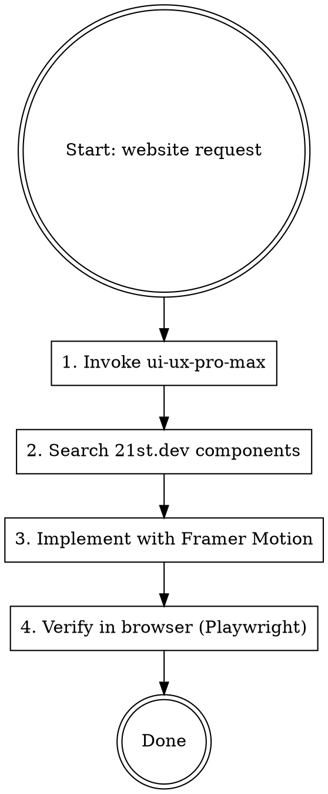

# Website Builder

Orchestrates three design intelligence tools to produce polished, animated websites:

1. **`ui-ux-pro-max`** — design system, style, color, typography, UX rules
2. **21st.dev Magic MCP** — production-ready component search & generation
3. **Framer Motion** — animation layer

**REQUIRED SUB-SKILL:** Always invoke `ui-ux-pro-max` at the start of every website build.

---

## Workflow



---

## Step 1 — Design System (ui-ux-pro-max)

Invoke the skill and run its search CLI to lock in design decisions **before** writing any code:

```bash
# Pick style
python3 ~/.claude/plugins/cache/ui-ux-pro-max-skill/ui-ux-pro-max/2.0.1/src/ui-ux-pro-max/scripts/search.py "<product type>" --domain product

# Pick color palette
python3 ~/.claude/plugins/cache/ui-ux-pro-max-skill/ui-ux-pro-max/2.0.1/src/ui-ux-pro-max/scripts/search.py "<style or mood>" --domain color

# Pick font pairing
python3 ~/.claude/plugins/cache/ui-ux-pro-max-skill/ui-ux-pro-max/2.0.1/src/ui-ux-pro-max/scripts/search.py "<style>" --domain typography

# Get stack-specific guidelines
python3 ~/.claude/plugins/cache/ui-ux-pro-max-skill/ui-ux-pro-max/2.0.1/src/ui-ux-pro-max/scripts/search.py "<topic>" --stack react
```

Lock in: `style`, `palette`, `font-pair`, `stack` before writing any component.

---

## Step 2 — Component Search (21st.dev Magic MCP)

Use the `magic` MCP tools to find and generate production-ready UI components. Available tools (loaded automatically after MCP connects):

| Tool | When to use |
|------|-------------|
| `21st_magic_component_builder` | Build a new UI component from a description |
| `21st_magic_component_inspiration` | Browse existing components by category/style |
| `logo_search` | Find logo/brand SVGs |

**Pattern — always search before building from scratch:**
```
Search: "hero section with gradient background and CTA button"
Search: "pricing table with toggle monthly/annual"
Search: "animated navbar with mobile drawer"
```

Prefer 21st.dev components over hand-rolling boilerplate. Customize only what differs from the design system.

---

## Step 3 — Framer Motion Animations

Install once per project:
```bash
npm install framer-motion
```

### Core Patterns

**Page entrance (fade + slide up):**
```tsx
import { motion } from "framer-motion";

const fadeUp = {
  hidden: { opacity: 0, y: 24 },
  visible: { opacity: 1, y: 0, transition: { duration: 0.5, ease: "easeOut" } },
};

<motion.div initial="hidden" animate="visible" variants={fadeUp}>
  {children}
</motion.div>
```

**Staggered children (lists, cards, features):**
```tsx
const container = {
  hidden: {},
  visible: { transition: { staggerChildren: 0.1 } },
};
const item = {
  hidden: { opacity: 0, y: 16 },
  visible: { opacity: 1, y: 0 },
};

<motion.ul variants={container} initial="hidden" animate="visible">
  {items.map((i) => <motion.li key={i.id} variants={item}>{i.label}</motion.li>)}
</motion.ul>
```

**Scroll-triggered (viewport):**
```tsx
<motion.section
  initial={{ opacity: 0, y: 40 }}
  whileInView={{ opacity: 1, y: 0 }}
  viewport={{ once: true, margin: "-80px" }}
  transition={{ duration: 0.6, ease: "easeOut" }}
>
```

**Hover / tap micro-interactions:**
```tsx
<motion.button whileHover={{ scale: 1.03 }} whileTap={{ scale: 0.97 }}>
  Click me
</motion.button>
```

**Layout animations (height collapse, reorder):**
```tsx
<motion.div layout layoutId="card-123">
```

### Animation Rules (from ui-ux-pro-max)

| Rule | Value |
|------|-------|
| Micro-interaction duration | 150–300 ms |
| Page entrance duration | 400–600 ms |
| Easing | `easeOut` for entrances, `easeIn` for exits |
| Properties | Always `transform`/`opacity` — never `width`/`height` directly |
| Reduced-motion | Always wrap with `useReducedMotion()` |

**Reduced-motion guard (required):**
```tsx
import { useReducedMotion } from "framer-motion";

function AnimatedSection({ children }) {
  const reduce = useReducedMotion();
  return (
    <motion.div
      initial={reduce ? false : { opacity: 0, y: 24 }}
      animate={{ opacity: 1, y: 0 }}
      transition={{ duration: reduce ? 0 : 0.5 }}
    >
      {children}
    </motion.div>
  );
}
```

---

## Step 4 — Verify

After building, use Playwright MCP to navigate to the local dev server and confirm:
- Visual style matches design decisions from Step 1
- Animations trigger correctly on scroll/hover
- No layout shift or FOUC
- Mobile viewport renders correctly (resize to 375px)

---

## Common Mistakes

| Mistake | Fix |
|---------|-----|
| Animating `height` or `width` directly | Use `scaleY` + `overflow: hidden` or `layout` prop |
| No `once: true` on viewport animations | Set `viewport={{ once: true }}` — re-triggering on scroll-up is jarring |
| Forgetting `useReducedMotion` | Always add it — accessibility requirement |
| Skipping ui-ux-pro-max design phase | Produces inconsistent color/type choices — always run Step 1 |
| Building components from scratch | Search 21st.dev first — saves 30–60 min per component |
| `staggerChildren` on large lists (50+ items) | Cap at 20 visible items or use `AnimatePresence` + virtualization |
