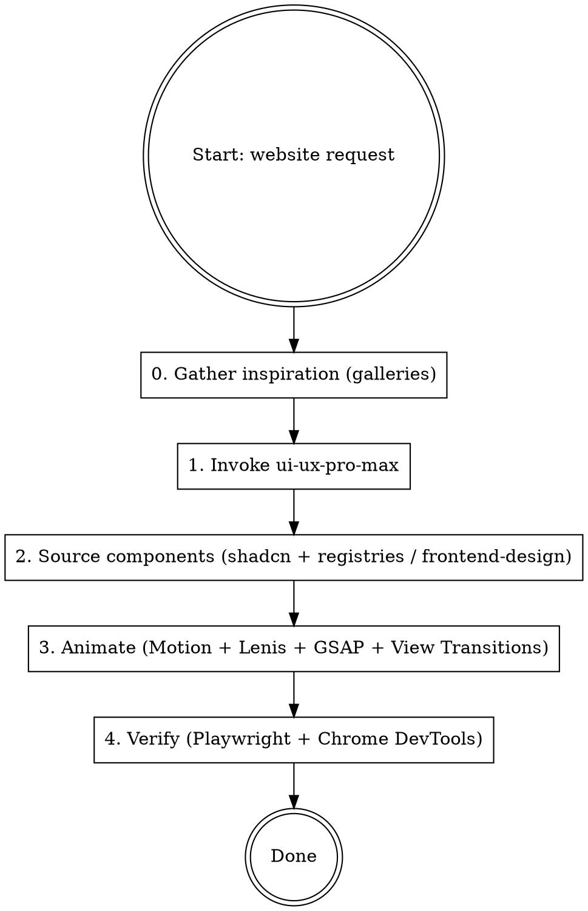

# Website Builder

Orchestrates design-intelligence and component tooling to produce **astounding, award-grade animated websites** — not generic AI pages.

| Layer | Tool | Role |
|-------|------|------|
| Inspiration | Awwwards · Godly · Land-book · SiteInspire (via `scraper` MCP) | Reference award-winning sites + steal motion ideas before designing |
| Design system | **`ui-ux-pro-max`** skill | Style, color, typography, UX rules, stack guidelines |
| Components (primary) | **shadcn MCP** + free animated registries (**Aceternity · Magic UI · React Bits**) + **`frontend-design`** skill | Free, you-own-the-code components; distinctive non-generic UI |
| Components (logos only) | **21st.dev Magic MCP** (`magic`) | `logo_search` for brand SVGs; component generation is human-in-loop (Step 2) |
| Imagery | **`nano-banana-multi:image-gen`** skill | Hero / background / OG images |
| Animation | **Motion** (`motion.dev`) + **Lenis** + **GSAP** (free, ScrollTrigger/SplitText) + **View Transitions API** | The thing that makes it astounding |
| Docs grounding | **context7** — local cache first, MCP on miss | Version-correct Motion/GSAP/Tailwind/shadcn APIs (see Doc Grounding) |
| Verify | **Playwright** MCP (functional/visual) + **Chrome DevTools** MCP (frame-rate/jank/CWV) | Confirm it works *and* holds 60fps |

**REQUIRED SUB-SKILL:** Always invoke `ui-ux-pro-max` at the start of every website build.

### Doc grounding (context7) — before writing any Motion / GSAP / Tailwind / shadcn / Next code

Animation APIs churn; never write them from memory. Follow this order:

1. **Local first** — check `/home/eze/projects/context7local/` for the `<tech>@<version>` snapshot and use it.
2. **MCP on miss/stale** — pull via the Context7 MCP only when the local snapshot is missing or out of date.
3. **Backfill** — after an MCP pull, write the immutable snapshot to `context7local/source/<tech>/<tech>-v<version>.md` and update `versions.lock` so next time is a local hit.

Already cached locally: `framer-motion 12.40` (= Motion), `tailwindcss 4.2`, `shadcn 4.6`, `nextjs 16`, `react 19`. **GSAP and Lenis are not cached yet** — first use seeds them via step 2→3.

**GSAP official skills (one-time):** GSAP is now 100% free incl. all plugins. Install the official agent skills so GSAP code is auto-grounded: `/plugin marketplace add greensock/gsap-skills`.

---

## Workflow



---

## Step 0 — Inspiration (design galleries)

Before locking a style, pull 2–4 reference sites that match the product's mood and **note their motion
techniques** (scroll behavior, reveal timing, hero treatment). None of these galleries have a public API
and all are JS-heavy with anti-bot, so use the **`scraper` MCP** (`scrape-url` / `extract-structured-data`
— stealth tier first, cloud fallback automatic). Playwright MCP is the fallback when you need to *see* the
live page; `WebFetch` will usually be blocked.

| Gallery | URL | Strongest for |
|---------|-----|---------------|
| **Awwwards** | `https://www.awwwards.com/websites/` | Cutting-edge visual craft, experimental animation, immersive storytelling |
| **Godly** | `https://godly.website/` | Hand-picked ~1000 best sites — exceptional scroll effects & motion |
| **Land-book** | `https://land-book.com/` | Landing pages & conversion patterns (updated daily) |
| **SiteInspire** | `https://www.siteinspire.com/` | Best filtering (style/type/subject/platform); editorial, minimal, typographic |

Rule of thumb: **Awwwards + Godly** for visual-craft / brand sites with bold motion; **Land-book +
SiteInspire** for conversion landing pages and clean production UI. Extract layout patterns, section order,
and motion ideas — feed them into Step 1, never copy pixel-for-pixel.

---

## Step 1 — Design System (ui-ux-pro-max)

Invoke the skill and run its search CLI to lock in design decisions **before** writing any code:

```bash
# Pick style
python3 ~/.claude/plugins/cache/ui-ux-pro-max-skill/ui-ux-pro-max/2.0.1/src/ui-ux-pro-max/scripts/search.py "<product type>" --domain product

# Pick color palette
python3 ~/.claude/plugins/cache/ui-ux-pro-max-skill/ui-ux-pro-max/2.0.1/src/ui-ux-pro-max/scripts/search.py "<style or mood>" --domain color

# Pick font pairing
python3 ~/.claude/plugins/cache/ui-ux-pro-max-skill/ui-ux-pro-max/2.0.1/src/ui-ux-pro-max/scripts/search.py "<style>" --domain typography

# Get stack-specific guidelines
python3 ~/.claude/plugins/cache/ui-ux-pro-max-skill/ui-ux-pro-max/2.0.1/src/ui-ux-pro-max/scripts/search.py "<topic>" --stack react
```

Lock in: `style`, `palette`, `font-pair`, `stack` before writing any component.

---

## Step 2 — Source Components

Prefer **components you own** over a metered generator. Search before hand-rolling boilerplate.

### Primary — shadcn MCP (free, MIT, zero-config)

Initialize once per project, then let the MCP install registry components:

```bash
pnpm dlx shadcn@latest mcp init --client claude   # zero-config; restart Claude Code after
```

Then prompt the MCP, e.g. *"Show me the components in the shadcn registry"*, *"add a pricing-table block"*.
Supports namespaced registries (`@registry/name`) so private/3rd-party component sets work too. You own
100% of the generated code — customize freely against the Step 1 design system.

### Free animated registries (pulled through the shadcn MCP — no extra MCP, no cap)

The distinctive, award-grade animated components are **free and unlimited** via shadcn-compatible
registries. Register the URL in `components.json`, then `npx shadcn add @<registry>/<component>` (or ask the
shadcn MCP). Use these for the "wow" sections instead of a metered generator:

| Registry | Best for |
|----------|----------|
| **Aceternity UI** | Bold hero / bento / parallax / glow sections — strong "designed in-house" feel |
| **Magic UI** | Motion-polished components (marquee, shimmer text, animated beams, borders) |
| **React Bits** | 500+ interactive effects and flourishes |

For bespoke, non-generic sections that no registry covers (custom heroes, unusual layouts) invoke the
**`frontend-design`** skill — distinctive, production-grade UI that avoids the generic AI look.

### Logos & quick variations — 21st.dev Magic MCP (`magic`)

21st's generated components trend generic and the tier is metered (≈100 credits/month free), so it is
**not** the component source — the free registries above are. Use it for two things only:

| Tool | When |
|------|------|
| `logo_search` | Brand / company logo SVGs — irreplaceable, low cost. Use freely. |
| `21st_magic_component_builder` | Only for a quick one-off variation. **Prefer human-in-loop:** point the user to `https://21st.dev/components`, let them pick, and paste it — rather than auto-spending credits. |

> **Auth:** the API key is read from the `MAGIC_API_KEY` env var (`API_KEY=${MAGIC_API_KEY}` in `.mcp.json`,
> value set in `~/.claude/settings.json`). Never inline a key — it lands in the public marketplace repo.

### Imagery — nano-banana

For hero images, backgrounds, illustrations, or OG/social cards, invoke the **`nano-banana-multi:image-gen`**
skill rather than placeholder stock.

---

## Step 3 — Animate (Motion + Lenis + GSAP + View Transitions)

> **Naming:** Framer Motion became independent in 2025 and is now **Motion** (`motion.dev`).
> New projects use the `motion` package and `motion/react` import. `framer-motion` still works as a
> legacy alias if a project already depends on it.

Animation is what separates an astounding site from a templated one. Build in three layers:
**(A) smooth scroll foundation → (B) scroll-linked storytelling → (C) micro-interaction polish.**

```bash
npm install motion lenis
```

### A. Smooth scroll foundation (Lenis)

Buttery inertial scroll is the single biggest "this feels premium" upgrade. Wrap the app once:

```tsx
import { ReactLenis } from "lenis/react";

export default function App({ children }) {
  return (
    <ReactLenis root options={{ lerp: 0.1, smoothWheel: true }}>
      {children}
    </ReactLenis>
  );
}
```

### B. Scroll-linked storytelling (the centerpiece)

**Parallax / scroll-progress transforms** — tie element motion to scroll position with `useScroll` +
`useTransform`. This drives parallax layers, progress bars, pinned reveals, horizontal scroll sections:

```tsx
import { motion, useScroll, useTransform } from "motion/react";
import { useRef } from "react";

function ParallaxHero() {
  const ref = useRef(null);
  const { scrollYProgress } = useScroll({ target: ref, offset: ["start start", "end start"] });
  const y = useTransform(scrollYProgress, [0, 1], ["0%", "40%"]);   // background drifts slower
  const opacity = useTransform(scrollYProgress, [0, 0.8], [1, 0]);  // content fades as you scroll past
  return (
    <section ref={ref} className="relative h-screen overflow-hidden">
      <motion.div style={{ y }} className="absolute inset-0 bg-[url(/hero.jpg)] bg-cover" />
      <motion.h1 style={{ opacity }} className="relative">…</motion.h1>
    </section>
  );
}
```

**Horizontal scroll section** (pinned, driven by vertical scroll):
```tsx
const { scrollYProgress } = useScroll({ target: ref });
const x = useTransform(scrollYProgress, [0, 1], ["0%", "-66%"]);
// <div ref={ref} className="h-[300vh]"> ... <motion.div style={{ x }} className="sticky top-0 flex">
```

**Staggered scroll reveals** — sections rise into view in sequence:
```tsx
const container = { hidden: {}, visible: { transition: { staggerChildren: 0.12 } } };
const item = { hidden: { opacity: 0, y: 24 }, visible: { opacity: 1, y: 0, transition: { duration: 0.6, ease: [0.22, 1, 0.36, 1] } } };

<motion.ul variants={container} initial="hidden" whileInView="visible" viewport={{ once: true, margin: "-80px" }}>
  {items.map((i) => <motion.li key={i.id} variants={item}>{i.label}</motion.li>)}
</motion.ul>
```

**Text reveal** — split a heading into words/lines and stagger them in for editorial impact:
```tsx
function RevealHeading({ text }) {
  const words = text.split(" ");
  return (
    <h2 aria-label={text}>
      {words.map((w, i) => (
        <span key={i} className="inline-block overflow-hidden">
          <motion.span className="inline-block"
            initial={{ y: "100%" }} whileInView={{ y: 0 }} viewport={{ once: true }}
            transition={{ delay: i * 0.05, duration: 0.6, ease: [0.22, 1, 0.36, 1] }}>
            {w}&nbsp;
          </motion.span>
        </span>
      ))}
    </h2>
  );
}
```

### C. Micro-interaction polish

**Spring hover + magnetic buttons** (springs feel alive; linear tweens feel cheap):
```tsx
<motion.button
  whileHover={{ scale: 1.04 }} whileTap={{ scale: 0.97 }}
  transition={{ type: "spring", stiffness: 400, damping: 17 }}>
  Get started
</motion.button>
```

**Page / route transitions** (`AnimatePresence` + shared-layout `layoutId` for morphing elements):
```tsx
<AnimatePresence mode="wait">
  <motion.main key={route}
    initial={{ opacity: 0, y: 12 }} animate={{ opacity: 1, y: 0 }} exit={{ opacity: 0, y: -12 }}
    transition={{ duration: 0.4, ease: "easeOut" }} />
</AnimatePresence>
```

**Layout animations** (height collapse, reorder, grid morphs): add the `layout` prop; share `layoutId`
across instances to morph between them (e.g. a card expanding into a modal).

### GSAP — scroll choreography, text & SVG (now 100% free)

After the Webflow acquisition GSAP is **fully free, including every former Club plugin** (ScrollTrigger,
SplitText, MorphSVG, DrawSVG, ScrollSmoother). Reach for it **alongside** Motion when the effect needs it:

- **ScrollTrigger** — complex scroll choreography: pinning, scrubbing, snap, multi-step timelines beyond
  what `useScroll` comfortably expresses.
- **SplitText** — production text reveals (lines/words/chars + masking) — cleaner than hand-splitting.
- **MorphSVG / DrawSVG** — path morphing and stroke-draw-on animations.

Role split: **Motion** = React component/gesture/layout state; **GSAP** = imperative timeline / scroll /
text / SVG. Ground GSAP via the official `gsap-skills` + context7 (it seeds the local cache on first use).
`npm install gsap` — all plugins are in the one package, no auth token.

### View Transitions API — native page/element transitions (free, zero-dep)

For route and same-page element transitions, prefer the **native View Transitions API** where supported
(same-document is Baseline as of late 2025). Next.js: `experimental.viewTransition` + React
`<ViewTransition>`; otherwise `document.startViewTransition(() => updateDOM())`. Progressive-enhance —
cross-document transitions are still Chromium/Safari only, so never make core navigation depend on them.

### 3D / WebGL hero

React Three Fiber (`@react-three/fiber` + `drei`) or **Spline** for no-code scenes — only when an
immersive 3D hero genuinely earns the bundle and perf cost. Gate behind explicit "3D" intent.

### Animation Rules (non-negotiable)

| Rule | Value |
|------|-------|
| Micro-interaction duration | 150–300 ms |
| Page / section entrance | 400–700 ms |
| Signature easing | custom cubic-bezier `[0.22, 1, 0.36, 1]` (expo-out) or spring for interactions |
| Animate only | `transform` / `opacity` — never `width`/`height`/`top`/`left` directly (jank) |
| Scroll reveals | `viewport={{ once: true }}` — re-triggering on scroll-up is jarring |
| Reduced-motion | Always honor `useReducedMotion()` — required |
| Target | 60fps; profile with Chrome DevTools MCP in Step 4 if anything stutters |

**Reduced-motion guard (required):**
```tsx
import { useReducedMotion } from "motion/react";

function AnimatedSection({ children }) {
  const reduce = useReducedMotion();
  return (
    <motion.div
      initial={reduce ? false : { opacity: 0, y: 24 }}
      whileInView={{ opacity: 1, y: 0 }}
      viewport={{ once: true }}
      transition={{ duration: reduce ? 0 : 0.6, ease: [0.22, 1, 0.36, 1] }}
    >
      {children}
    </motion.div>
  );
}
```

---

## Step 4 — Verify

After building, run the dev server and verify on two distinct axes — **does it work** (Playwright) and
**is it actually smooth** (Chrome DevTools).

**Functional / visual (Playwright MCP):** navigate to the local dev server and confirm:
- Visual style matches the Step 1 design decisions and the Step 0 references
- Smooth scroll feels inertial (Lenis active), scroll-linked effects track the scrollbar
- Reveal/stagger animations fire once on entry, not on scroll-up
- Hover/tap springs respond; page transitions are clean (no flash/FOUC)
- Mobile viewport renders correctly (resize to 375px) and heavy scroll effects degrade gracefully
- `prefers-reduced-motion` disables non-essential motion

**Frame-rate / performance (Chrome DevTools MCP):** Playwright confirms it *renders and works*; Chrome
DevTools confirms it's *actually smooth*. Record a performance trace while scrolling and check for **dropped
frames / long tasks**, plus Core Web Vitals (LCP / CLS / INP). Polish that runs at 30fps isn't polish — if
a scroll effect drops frames, the most common cause is animating a non-compositor property (see rules).

> Runs **headless** on this Linux VM — no Chrome install needed. Puppeteer auto-downloads chrome-for-testing
> on first run; pass `--headless=true`, or `--executablePath` to the existing Playwright chromium to skip
> the download. The MCP is wired in this plugin's `.mcp.json` as `chrome-devtools`.

---

## Common Mistakes

| Mistake | Fix |
|---------|-----|
| Skipping the inspiration pass | Pull 2–4 gallery references in Step 0 — anchors design AND motion before code |
| Static page that "fades in" and stops | Add scroll-linked storytelling (parallax/pin/horizontal) — that's the astounding part |
| No smooth scroll | Add Lenis — biggest perceived-quality jump for least effort |
| Default linear easing everywhere | Use expo-out `[0.22, 1, 0.36, 1]` for reveals, springs for interactions |
| Using 21st.dev as the component source | Use the free shadcn registries (Aceternity / Magic UI / React Bits); 21st is `logo_search` + human-in-loop variations only |
| Writing Motion/GSAP/Tailwind from memory | Ground against the **local context7 cache first**, MCP on miss, then backfill — APIs churn |
| Importing from `framer-motion` in a new project | Use `motion` package / `motion/react` import |
| Animating `height`/`width`/`top`/`left` directly | Use `scaleY` + `overflow: hidden` or the `layout` prop |
| Forgetting `useReducedMotion` | Always add it — accessibility requirement |
| Skipping ui-ux-pro-max design phase | Produces inconsistent color/type choices — always run Step 1 |
| `staggerChildren` on large lists (50+ items) | Cap at ~20 visible items or use `AnimatePresence` + virtualization |
| Hand-rolling complex scroll/text effects in Motion | Use GSAP ScrollTrigger/SplitText (now free) for pinning, scrubbing, and masked text reveals |
| Reaching for Three.js by default | Motion + Lenis + GSAP cover ~95% of award-grade 2D work; add WebGL only for genuine 3D |
| Declaring "smooth" without measuring | Profile with Chrome DevTools MCP — check dropped frames + CWV, don't eyeball it |
